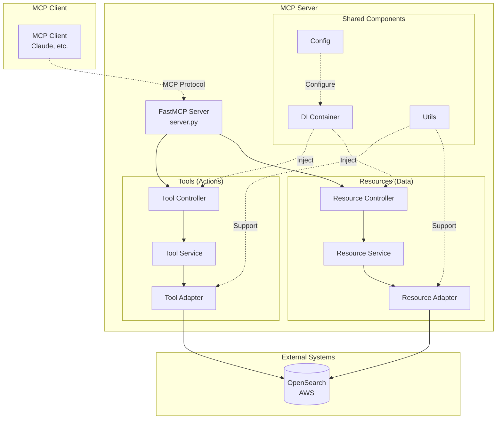
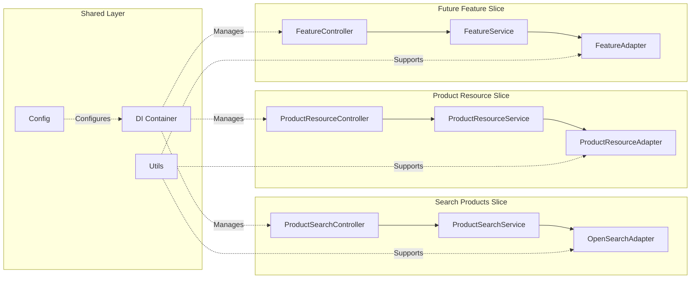
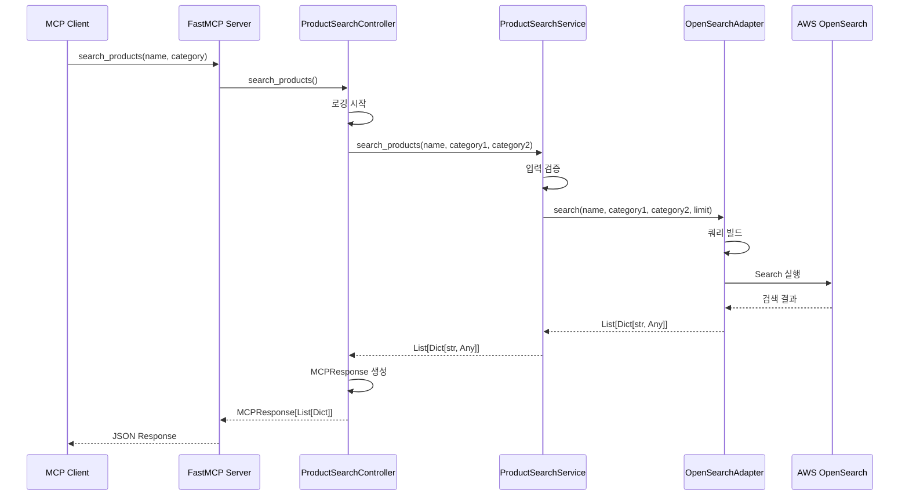
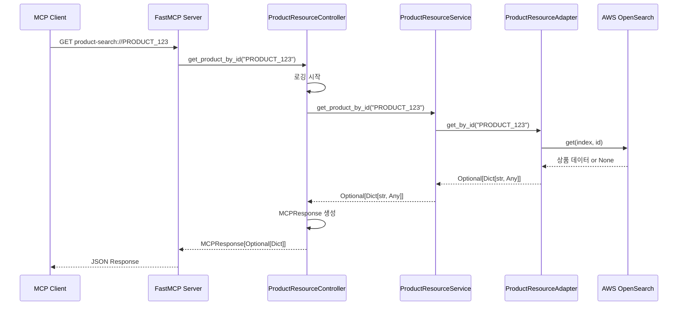
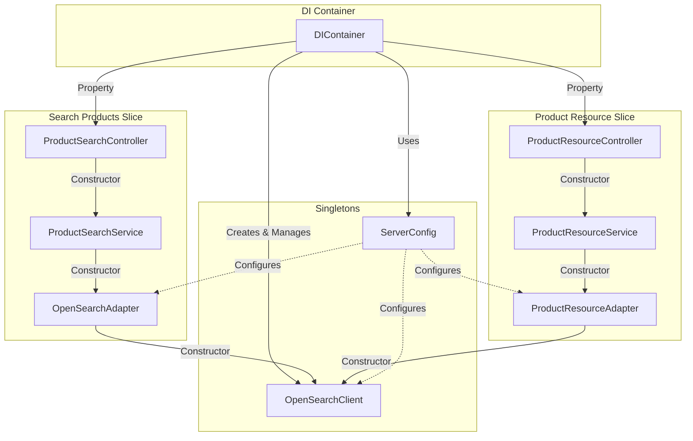
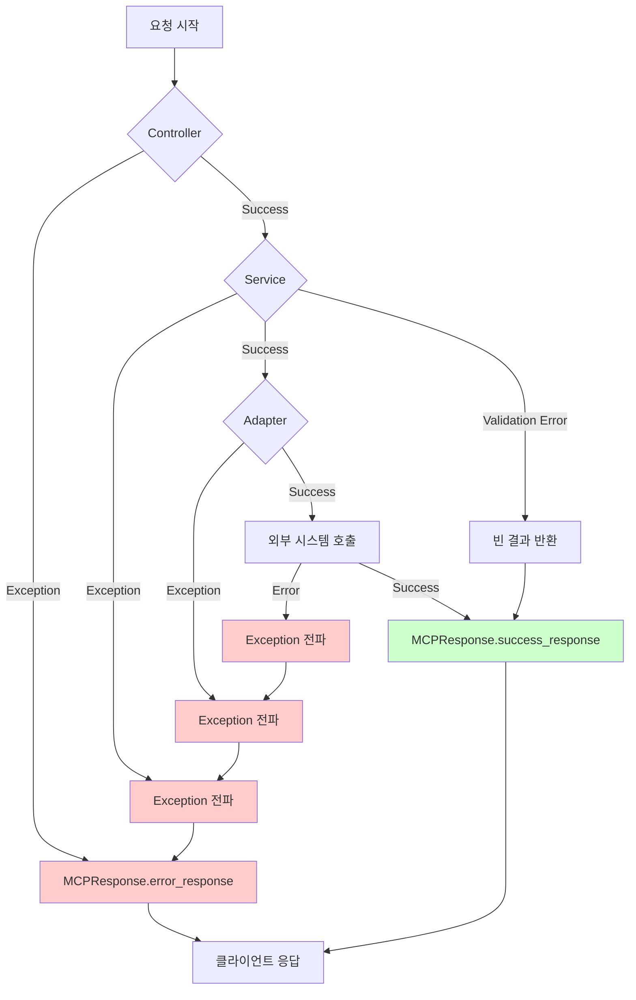
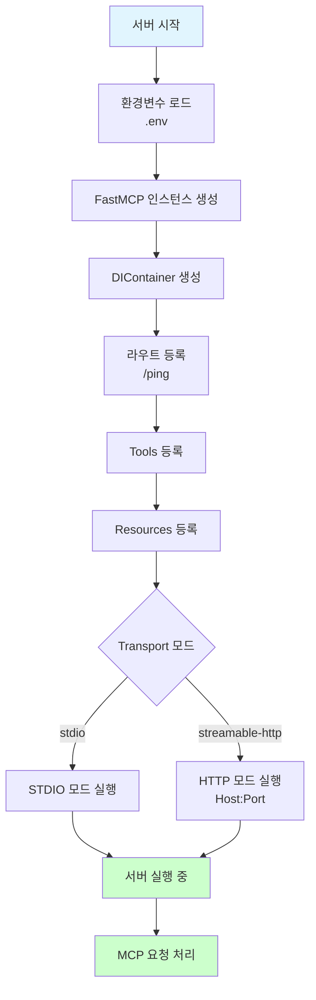
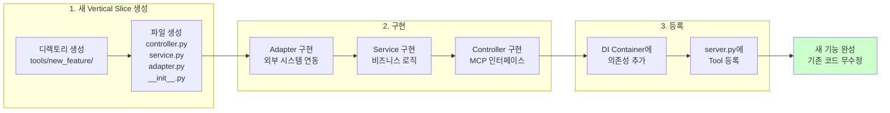

# MCP 서버 아키텍처 다이어그램

이 문서는 MCP 서버의 아키텍처와 데이터 플로우를 시각적으로 보여줍니다.

## 1. 전체 시스템 아키텍처

## 2. Vertical Sliced Architecture

## 3. 데이터 플로우 - Tool 요청 처리

## 4. 데이터 플로우 - Resource 요청 처리

## 5. 의존성 주입 구조

## 6. 에러 처리 플로우

## 7. 서버 시작 플로우

## 8. 새로운 기능 추가 플로우

## 관련 문서

- [구현 가이드](IMPLEMENTATION_GUIDE.md) - 단계별 구현 방법
- [MCP 서버 특성](MCP_SERVER.md) - Tool과 Resource 베스트 프랙티스
- [테스트 가이드](TESTING_GUIDE.md) - 테스트 전략 및 구현
- [환경 설정](CONFIG_ENVIRONMENT.md) - 배포 및 운영 가이드
